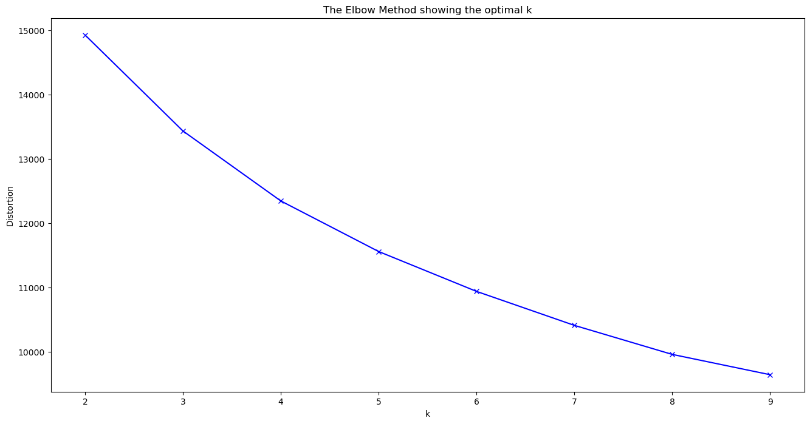

# Customer Clustering Analysis
## Project Overview
This project applies unsupervised learning to segment customers into distinct groups based on purchasing behavior and demographic attributes. The goal is to uncover hidden patterns and profile different customer segments to support targeted marketing and personalized business strategies.

## Dataset
- Source: coursework dataset (provided in class; not public).  
- Initial size: 3,900 rows and 19 columns.  
- Key features include: customer demographics (Age, Gender), purchase details (Purchase Amount, Frequency, Item Category), payment and shipping preferences, subscription status, and review ratings.

## Workflow
1. **Exploratory Data Analysis (EDA)**  
   - Removed identifier column (Customer ID) and fixed inconsistent categorical values.  
   - Transformed `Birth Date` into numeric `Age`.  
   - Performed univariate analysis, distribution checks, and outlier inspection.  
   - Examined feature correlations (heatmap) to check redundancy.

2. **Preprocessing**  
   - Feature extraction to create more meaningful predictors (e.g., convert date → age, aggregate frequency).  
   - Encoding categorical variables (label / one-hot where appropriate).  
   - Scaling numeric features.  
   - Applied PCA to reduce dimensionality and help clustering.

3. **Clustering**  
   - Used K-Means clustering with multiple k values tested.  
   - Evaluated cluster candidates using the Elbow Method and Silhouette Score.  
   - Selected **k = 3** based on the combined evaluation.

4. **Cluster Analysis**  
   - Performed descriptive statistics and distribution checks per cluster.  
   - Interpreted cluster characteristics to derive actionable recommendations.

## Cluster Profiling (Summary)
> The cluster descriptions below are derived from the notebook's cluster-profiling section (averages, distributions, and categorical proportions).
> Elbow method that shows optimal k = 3

### Customer Cluster 0
1. Average time since previous purchase is high (≈ 25.4 months), similar to Cluster 1 — their last purchase tends to be older than Cluster 2.  
2. Average **Purchase Amount** is the lowest among clusters.  
3. Average **Age** ≈ **44.01** years (middle range).  
4. Purchase frequency: many purchase on **Monthly, Quarterly, and Annually** basis.  
5. Preferred payment methods: **Debit card** and **PayPal**.  
6. Highest proportion of **subscription** holders among clusters.  
7. Shipping preferences: many prefer **store pickup**, **free shipping**, and **next day air**.  

**Recommendation:** Target affordable products and subscription-based promos. Leverage monthly/seasonal campaigns to increase engagement.

---

### Customer Cluster 1
1. Highest average **Purchase Amount** (~**60.28 USD**).  
2. Average time gap from previous purchase is high (≈ 25.4 months), like Cluster 0.  
3. Highest **Review Rating** (mean ≈ **3.77**, median ≈ **3.8**), indicating higher satisfaction.  
4. Oldest average age among clusters (≈ **44.53** years).  
5. Purchase frequency: **Monthly, Quarterly, Annually**.  
6. Preferred payment methods: **PayPal** and **Credit Card**.  
7. Majority **do not have subscriptions**.  
8. Prefer **free shipping**.  

**Recommendation:** Recommend higher-priced or premium items aligned with seasonal trends, include free-shipping deals, and emphasize service quality despite lack of subscription.

---

### Customer Cluster 2
1. Average **Purchase Amount** is mid-range (~**59.58 USD**).  
2. Lower average **Review Rating** (mean ≈ **3.7404**) compared to other clusters.  
3. Youngest average age (≈ **43.86** years).  
4. Includes all customers who purchase on **Weekly, Bi-Weekly,** and **Fortnightly** basis — most routine buyers.  
5. Many prefer **cash** payment.  
6. Most customers in this cluster **do not have subscriptions**.  
7. Shipping preference: **Standard** and **Express** shipping dominate.  

**Recommendation:** Promote trending / fast-fashion items and quick-turn offers; exploit frequent-purchase patterns with time-limited deals.

---

## 🛠️ Tools & Libraries
- Python, VSCode  
- pandas, numpy, matplotlib, seaborn  
- scikit-learn (KMeans, PCA, metrics)  

## 📈 Key Insights
- K-Means produced **3 meaningful clusters** with distinct demographic and behavioral traits.  
- Feature engineering (e.g., converting birth date → age, standardizing categorical values) improved data quality and interpretability.  
- PCA aided in dimensionality reduction while preserving variance helpful for clustering.  
- The cluster profiles offer clear directions for targeted marketing strategies (affordable promos, premium offers, fast-fashion campaigns).

## 📌 Notes & Next Steps
- Consider validating cluster stability with alternative clustering algorithms (e.g., hierarchical clustering, DBSCAN).  
- Explore propensity models per cluster to predict responsiveness to specific promotions.  
- If available, include transactional time-series features or RFM (Recency, Frequency, Monetary) aggregations to refine segmentation.

---

