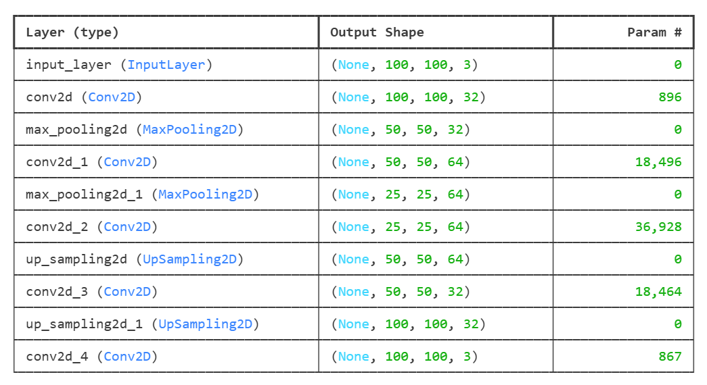

# Image Denoising with Autoencoder  
## Project Overview  
This project applies **Deep Learning Autoencoders** to remove noise from seashell images. The dataset consists of **1,074 clean seashell images** provided by the lecturer. Synthetic noisy images were generated and paired with the original clean images to train the autoencoder.  

The main goal is to reconstruct high-quality clean images from noisy inputs, which is a common problem in **image denoising, compression, and restoration tasks**.  

---

## Dataset  
- Total: 1,074 seashell images (RGB format).  
- Image properties checked:  
  - Resolution uniform at **100x100 pixels**.  
  - RGB format (no anomalies in channel count).  
  - Light and color distributions are consistent.  
- Noisy dataset created with Gaussian noise (mean = 0, std = 0.1).  
- Data split: **80% train, 10% validation, 10% test**.  
  - **X:** noisy images  
  - **Y:** clean images  

---

## Workflow  
1. **EDA (Exploratory Data Analysis)**  
   - Checked image resolution, color distribution, and brightness histogram.  
   - Verified dataset consistency before applying noise.  

2. **Preprocessing**  
   - Generated noisy images with Gaussian distribution.  
   - Split dataset into train/validation/test sets.  
   - Normalized pixel values to range [0, 1].  

3. **Modeling**  
   - **Baseline Model:**  
     - CNN autoencoder with Conv2D, MaxPooling, UpSampling.  
     - Architecture shown in first diagram (≈74K parameters).
       

   - **Modified Model:**  
     - Added **Conv2D** and **Conv2DTranspose** layers.  
     - Architecture shown in second diagram (≈186K parameters).
       

4. **Evaluation Metrics**  
   - **MSE (Mean Squared Error)** → pixel-level reconstruction error.  
   - **MAE (Mean Absolute Error)** → average absolute error.  
   - **SSIM (Structural Similarity Index)** → perceptual similarity between reconstructed and original images.  

---

## Results  

| Model          | MSE      | MAE      | SSIM   |
|----------------|----------|----------|--------|
| **Baseline**   | 0.000637 | 0.008805 | 0.9562 |
| **Modified**   | 0.000983 | 0.011237 | 0.9471 |

➡️ **Baseline autoencoder outperformed the modified model**, achieving lower error rates and higher perceptual similarity (SSIM ≈ **95.6%**).  

---

## Tools & Libraries  
- Python, VSCode  
- TensorFlow / Keras (Conv2D, MaxPooling2D, UpSampling2D, Conv2DTranspose)  
- NumPy, Matplotlib, OpenCV  

---

## Key Insights  
- Adding deeper layers with Conv2DTranspose did not improve denoising performance — the simpler baseline model generalized better.  
- Autoencoders are highly effective for image denoising even with relatively small datasets (≈1K images).  
- SSIM provides a better reflection of perceptual quality than MSE/MAE alone.  

---

## Next Steps  
- Experiment with **transfer learning** from pretrained denoising architectures.  
- Use **denoising autoencoder with skip connections (U-Net style)** for improved feature retention.  
- Test robustness against different types of noise (salt-and-pepper, speckle).  
